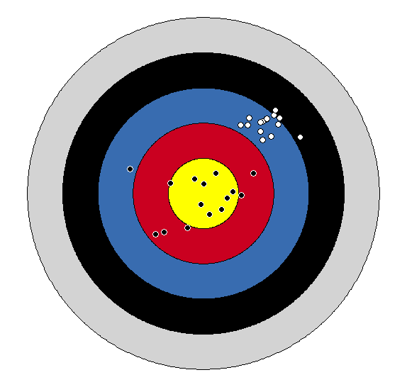

    

Welcome to the course website for Math 243, Fall 2021! 

Here you can find a course syllabus, announcements, the schedule, homework assignments, and information about projects and exams. Check back frequently for updates.

****************************************

**Instructor**: Jonathan "Nate" Wells

**Email**: <wellsj@reed.edu>

**Classroom**: Library 389, MWF 9 - 9:50am

**Office**: Library 392

**In-person Office Hours**: M 3-4pm, W 10-11am, F 10-11am

**Virtual Office Hours**: T 6-7pm

**Zoom Link**: <https://zoom.us/my/wellsj392>